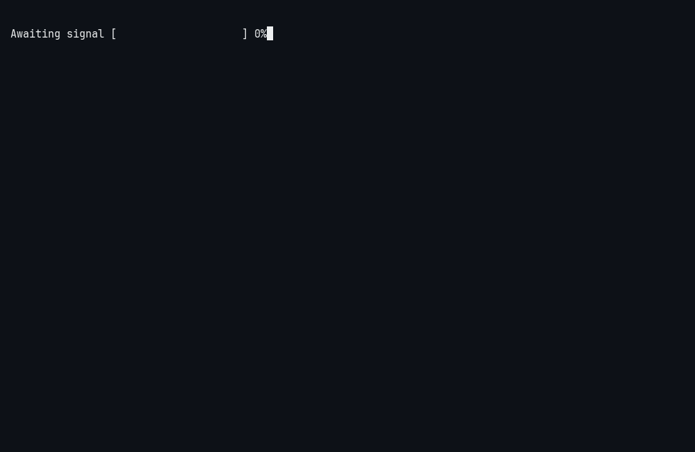

<!-- GIFOS_SECTION_START -->
<picture>
<source media="(prefers-color-scheme: dark)" srcset="./output.gif">
<source media="(prefers-color-scheme: light)" srcset="./output.gif">

</picture>
<!-- GIFOS_SECTION_END -->

## Professional Summary
Backend Engineer & Data Science Enthusiast proficient in Python, JavaScript and C/C++. Experienced in building scalable APIs and data-driven systems, leveraging NumPy and Pandas for complex data analysis. Adept at managing relational databases and ML-integration within a Linux development environment. Focused on writing performance-oriented code and bridging the gap between robust backend architecture and analytical insights. 

### Socials
   [![LinkedIn](https://img.shields.io/badge/LinkedIn-%2390e0ef.svg?logo=data:image/png;base64,iVBORw0KGgoAAAANSUhEUgAAADwAAAA8CAYAAAA6/NlyAAAACXBIWXMAAAsTAAALEwEAmpwYAAADMElEQVR4nO2bS2gUQRCGv/hCNEEFI4qCHjQa96DJCj5yENxbwBxEkagIHsxF4wMELz4hoCgexYggxOhBjCef9yAKycFXBDGgQVG8KBpFjZqVhooUa09mZg2Z7Un/ULBMdffWl+merumtgJeX11hQBZABsiVqGYnxv7UCuA38BPIlbibGW0BtsbBbgR8lABLXTMyNcWGzCvYzcBhYVwJTN8hywBGgX0HXxAG+o2CrcEdLFLSZ3pFUodasubOu6ajEPgCUR+mQUevBTBXXlFPxL43SIas6mM+uKXb8WQ/8r8qABuAS0AnclafkbFIIPAnoCNgDP8j2lSrgQ8rfK3e5Q20HBrqSFAH3iu8GMEFdr1LJSjMpAv4ivn0W33PxnSFFwA/E9wiYo67XA7/Et4MUAdcDgypnfQq8Un1eAFNI2ba0CXhveUo/BBaS0sRjGrAFOAm0yJ0fR/IaceCpIa9q1aptZUjb+QEvL1WS08+SJCdR4CcRXsJ3C+ynkHbmIVcHLABOAD2WNmbptAGrkgLOR7DzBeMMZ90xTlauA9OTAm6xTNFnAcDbLG0LYcxhw0VgO7AWWANskD39rWpnvmNeEsBNFl93AHDYTLkAzBgmJrPNnVLt7wETXQPuAX4HZGxBOqDGPFhk/IkBmzu6SD6Pl9MJ82CaS7DK5FXUjPkOmOwS8BDAroI1aqxL1rFNq1W7ja4Bnw7ZsmxARi+lzVmXgOtUTt4ph28Zyd7eyPWPwExL3za1pTkDfEVBmTRVa6Xqu9fS97j4XrsE3Ce+cwFxdKlko1B7xPetiPgTAx4Q337suiz++xZfkxo7bvyJJx62cZAxgtapB1bywGHywAXywEoeGA/8Vx64QB44aeB2+WJtfQHALZa2UYH7LH3bRxN4UPmDrFUKxPIRbGdAHK0R+g6OBvC1EOivwHo5sH8cErA5plkcEEeDjDUc7NXRAC51xY4/M9bKlirUu6opVHFNx+IWpiEVtHmp2zDlfK6oWtWamJKMyKpVv/f0SzlfTtZEKVpO7uwQ7HdgWdy/VqOj5cMGdjNFqga4qdZ0KduATOPljIDKHfgXgMgPKC8vL5zVH98QlCXXQKnGAAAAAElFTkSuQmCC&logoColor=white)](www.linkedin.com/in/sarveshtikekar)    

### Technology Stack

  <table align="left">
    <tr>
      <td align="center" width="160"><b>Languages</b></td>
      <td>
        
        
        
        
        
        
      </td>
    </tr>
    <tr>
      <td align="center"><b>Frameworks</b></td>
      <td>
        
        
        
        
        
        
      </td>
    </tr>
    <tr>
      <td align="center"><b>Databases</b></td>
      <td>
        
        
      </td>
    </tr>
    <tr>
      <td align="center"><b>Dev Tools</b></td>
      <td>
        
        
        
        
        
      </td>
    </tr>
    <tr>
      <td align="center"><b>OS in Use</b></td>
      <td>
        
        
      </td>
    </tr>
  </table>

  

### GitHub Statistics

 

 

## Contribution Feed to my Snake🐍

